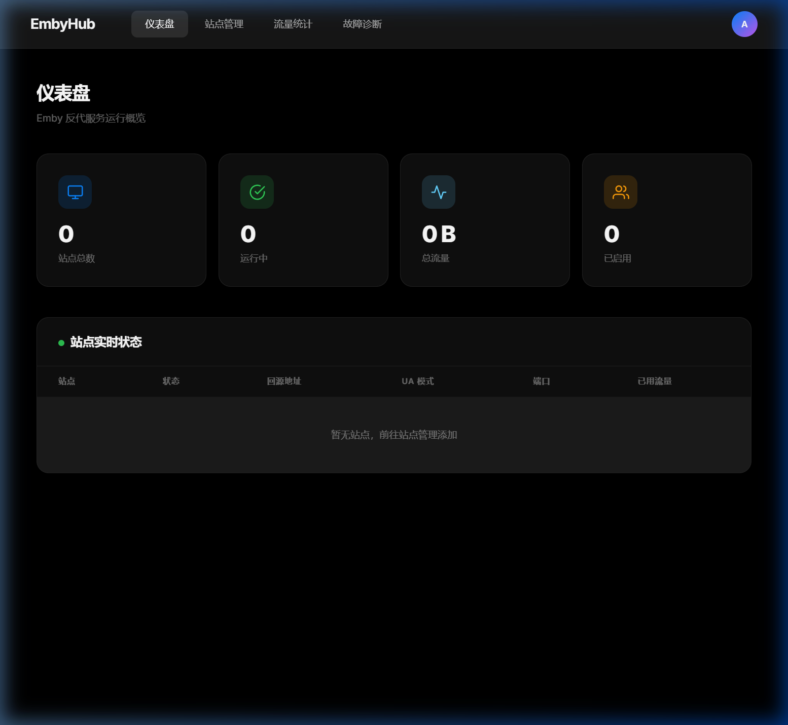
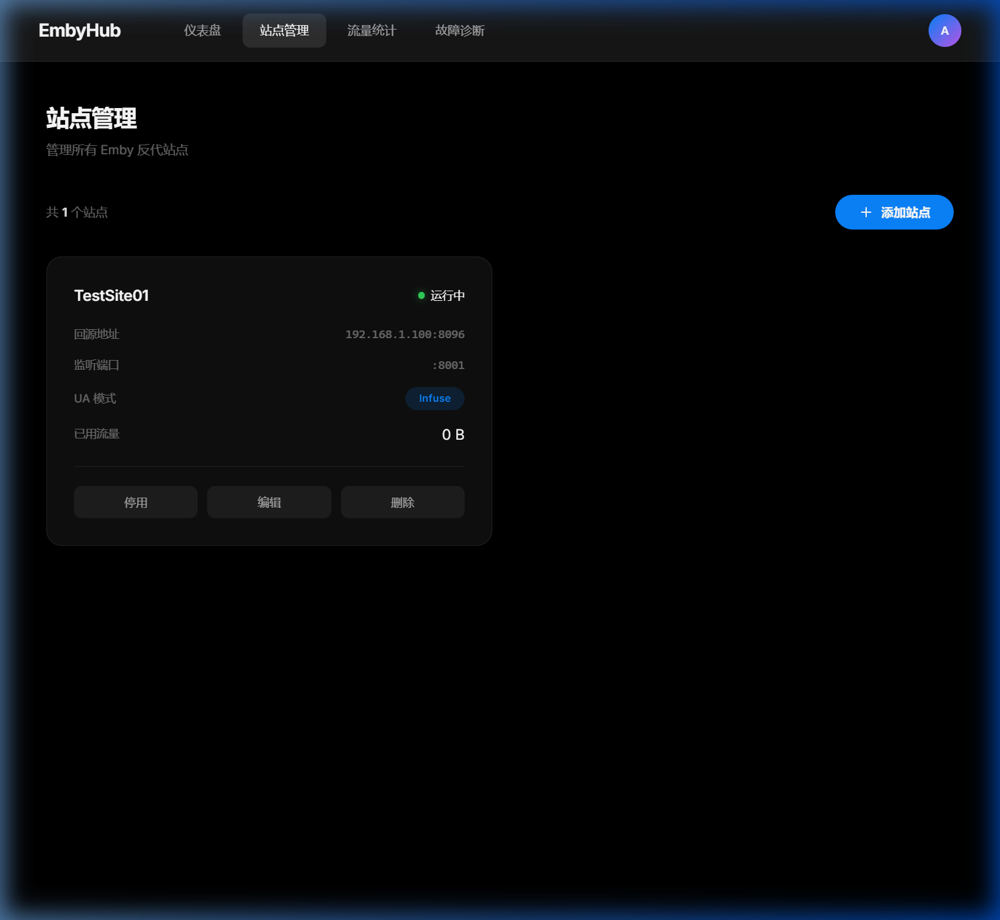
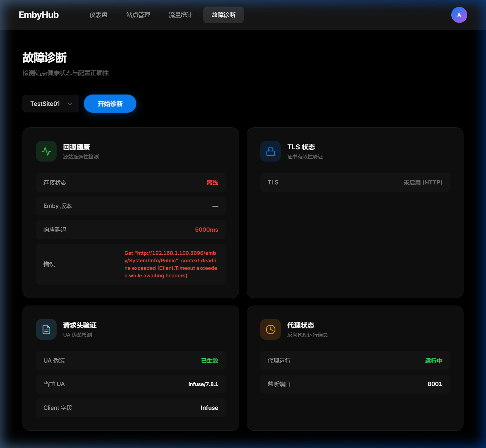

# EmbyHub

轻量级 Emby 反向代理管理面板 — Apple TV 风格 UI

<p align="center">
  
</p>

## ✨ 特性

- 🎬 **Apple TV 风格** — 纯黑背景、磨砂玻璃导航、流畅动画
- 🔄 **Emby 反代引擎** — 每站点独立端口，httputil.ReverseProxy 驱动
- 🎭 **3 种 UA 伪装** — Infuse / Web / 客户端（Emby Theater）
- 📊 **流量计量** — 原子计数器 + Canvas 图表可视化
- 🔍 **一键诊断** — 回源健康、TLS 证书、UA 验证、代理状态
- 🔑 **JWT 认证** — bcrypt 密码哈希，72 小时 Token
- 📦 **单二进制** — 嵌入前端 + SQLite，零依赖部署

## 🚀 快速开始

### 编译

```bash
git clone https://github.com/snnabb/emby-panel.git
cd emby-panel
go build -o emby-panel .
```

### 运行

```bash
./emby-panel                    # 默认端口 9090
./emby-panel --port 8080        # 自定义端口
```

### 环境变量

| 变量 | 默认值 | 说明 |
|------|--------|------|
| `PORT` | `9090` | 管理面板端口 |
| `DB_PATH` | `emby-panel.db` | SQLite 数据库路径 |
| `JWT_SECRET` | 内置默认 | JWT 签名密钥 |

## 📸 截图

<details>
<summary>站点管理</summary>

</details>

<details>
<summary>故障诊断</summary>

</details>

## 🏗️ 技术栈

- **后端**: Go `net/http` + `httputil.ReverseProxy`
- **数据库**: `modernc.org/sqlite` (纯 Go, 无 CGO)
- **前端**: 原生 HTML/CSS/JS SPA
- **认证**: 手写 JWT (HMAC-SHA256) + bcrypt

## 📄 License

MIT
