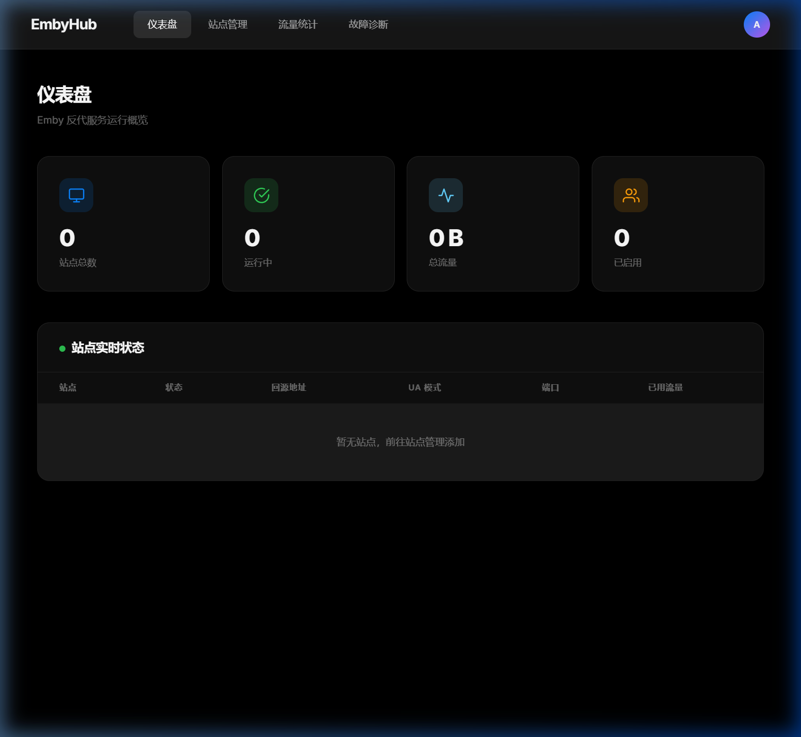
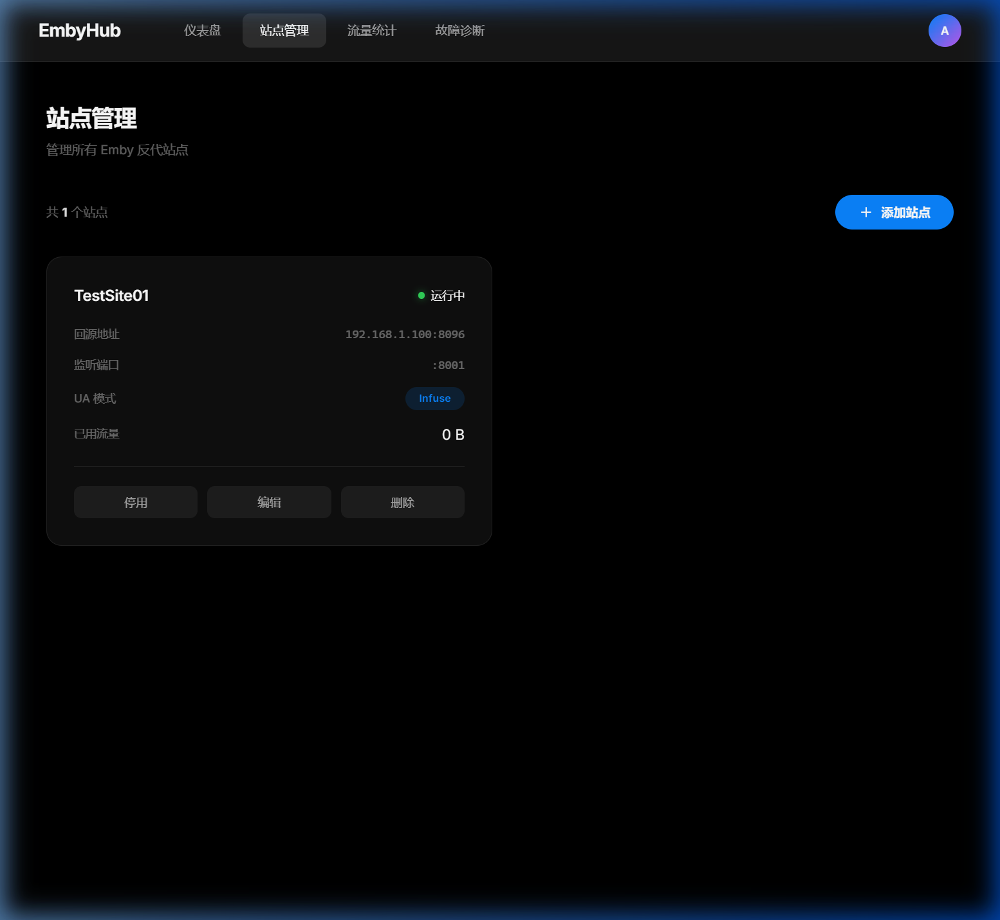
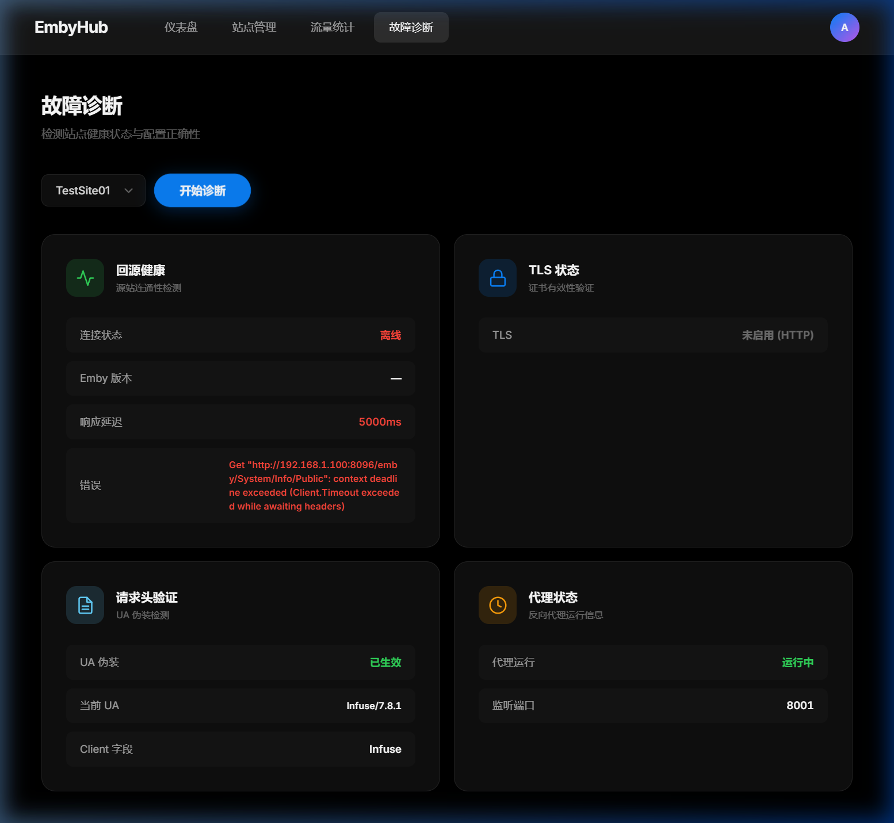

<div align="center">

# Meridian

轻量级 Emby 反向代理管理面板
单文件 Go 后端 + 嵌入式 SPA 前端，开箱即用

[](https://go.dev)
[](https://pkg.go.dev/modernc.org/sqlite)
[](https://github.com/snnabb/Meridian/actions/workflows/ci.yml)
[](https://github.com/snnabb/Meridian/pkgs/container/meridian)
[](LICENSE)

</div>

## 界面预览

| 仪表盘 | 站点管理 | 故障诊断 |
|:---:|:---:|:---:|
|  |  |  |

## 这是什么

Meridian 是一个专为 Emby 媒体服务器设计的反向代理管理面板（Emby reverse proxy management panel）。它解决的核心问题是：**当你需要在一台机器上管理多个 Emby 反代站点时，不想手写 Nginx 配置，不想逐个维护 UA 伪装规则，也不想自己实现流量计量和限速。**

Meridian 把这些事情打包成一个单二进制程序，带管理界面，带实时监控，开箱可用。

## 友链

- [NodeSeek](https://www.nodeseek.com/)
- [Linux.do](https://linux.do/)

## 核心特性

| 功能 | 说明 |
|------|------|
| **多站点反代** | 每个站点独立监听端口，独立配置上游地址 |
| **双上游分流** | 网页/API 和播放/转码流量可分别指向不同上游 |
| **UA 伪装** | 3 种预设（Infuse / Web / 客户端）或每站自定义身份；HTTP、WebSocket 与受限播放重定向统一改写 |
| **流量管控** | 按站点统计流量、设置限速、设置配额 |
| **WebSocket 代理** | 完整支持 Emby 的 WebSocket 通信 |
| **SSE 实时推送** | 仪表盘数据通过 Server-Sent Events 实时更新 |
| **故障诊断** | 回源健康检测、上游 TLS 证书检查、请求头预览 |
| **JWT 认证** | HttpOnly 会话 Cookie 认证，密码 bcrypt 存储 |
| **单二进制部署** | 前端嵌入二进制，SQLite 持久化，无外部依赖 |

---

## 快速部署

### Linux / macOS — 一键安装（适用于已发布版本）

一行命令进入精简菜单：安装、更新到最新版、修改管理员密码、卸载。

```bash
bash <(curl -fsSL https://raw.githubusercontent.com/snnabb/Meridian/master/install.sh)
```

> 首次安装从 GitHub Releases 下载最新二进制，并使用同一 Release 中的 `SHA256SUMS` 强制校验。systemd 部署默认使用独立的 `meridian` 非 root 用户。重复运行 `install` 不会更新程序，只用于补充或重新配置面板域名。
>
> 首次创建管理员需要安装结束时显示的初始化令牌。Linux 一键安装会将其保存在受保护的 `/opt/meridian/.env`；若在尚未创建管理员前遗失安装输出，可由服务器 root 用户从该文件恢复。重复运行 `install` 或 `update` 只会为旧配置补齐缺失令牌，不会轮换已有令牌。令牌等同于首次管理员创建权限，请勿贴到 Issue、日志或截图中。

也可以直接指定四个动作：

```bash
# 首次安装最新版；过程中可选择是否配置面板 HTTPS 域名
bash <(curl -fsSL https://raw.githubusercontent.com/snnabb/Meridian/master/install.sh) install

# 非交互配置面板域名（邮箱可省略）
bash <(curl -fsSL https://raw.githubusercontent.com/snnabb/Meridian/master/install.sh) install \
  --domain panel.example.com --email admin@example.com -y

# 更新：自动创建数据备份、保留上一版本、启动后健康检查，失败则自动回滚
bash <(curl -fsSL https://raw.githubusercontent.com/snnabb/Meridian/master/install.sh) update

# 隐藏输入两次新密码；同时轮换 JWT_SECRET，使全部旧令牌失效
bash <(curl -fsSL https://raw.githubusercontent.com/snnabb/Meridian/master/install.sh) password

# 卸载默认保留数据；只有显式添加 --purge 才删除数据
bash <(curl -fsSL https://raw.githubusercontent.com/snnabb/Meridian/master/install.sh) uninstall
```

选择配置域名时，脚本会安装或复用 Nginx、Certbot（支持 apt、dnf/yum、apk、pacman），申请证书并启用 HTTP→HTTPS。生成的配置只代理管理面板 `127.0.0.1:9090`（或自定义 `PORT`），不会读取或修改站点回源、播放地址、50001 或其他站点监听端口。macOS 可安装 Meridian，但不支持自动域名配置。

更新和改密会在内部自动创建一致性备份、执行健康检查并在失败时回滚；这些内部操作不再作为公开菜单命令。备份默认保存在 `/opt/meridian-backups`，权限为 `0600`，其中包含数据库和密钥，请按敏感文件保管。卸载默认保留数据和备份；`--purge` 才删除数据，并且不会删除 Nginx、Certbot 或证书。

### Docker

```bash
export MERIDIAN_SETUP_TOKEN="$(openssl rand -hex 32)"  # 保存此值，首次登录时需要输入
docker run -d --name meridian \
  --restart unless-stopped \
  --read-only \
  --cap-drop ALL \
  --security-opt no-new-privileges:true \
  --ulimit nofile=65536:65536 \
  --tmpfs /tmp:rw,noexec,nosuid,size=16m \
  -p 127.0.0.1:9090:9090 -p 8001-8010:8001-8010 \
	-v meridian-data:/app/data \
	-e JWT_SECRET=$(openssl rand -hex 32) \
	-e SETUP_TOKEN="$MERIDIAN_SETUP_TOKEN" \
	ghcr.io/snnabb/meridian:latest
```

> `8001-8010` 是反代站点监听端口范围，按实际需要调整。
>
> 管理面板默认只映射到宿主机 `127.0.0.1:9090`，建议再通过 HTTPS 反向代理访问。如果确实需要直接通过公网 IP 访问，可改成 `-p 9090:9090`，并同时配置防火墙白名单。
>
> 首次创建管理员前必须设置并妥善保存 `SETUP_TOKEN`；服务不会把它写入启动日志。上面的命令把随机值保存在 `MERIDIAN_SETUP_TOKEN` 中，请在关闭当前 shell 前记入密码管理器，以便在面板中输入。
>
> 官方镜像会在推送 `v*` 标签时由 GitHub Actions 构建并推送到 GHCR。若仓库尚未发布版本，或 GHCR 中暂时没有可用镜像，请改用源码构建。

### Windows

```powershell
Invoke-WebRequest -Uri "https://github.com/snnabb/Meridian/releases/latest/download/meridian-windows-amd64.exe" -OutFile "meridian.exe"
$env:JWT_SECRET = -join ((1..32) | ForEach-Object { '{0:x2}' -f (Get-Random -Max 256) })
$env:SETUP_TOKEN = -join ((1..32) | ForEach-Object { '{0:x2}' -f (Get-Random -Max 256) })
.\meridian.exe
```

> Windows 二进制下载同样依赖 GitHub Releases。没有已发布版本时，请使用源码构建。

### 从源码构建

```bash
git clone https://github.com/snnabb/Meridian.git && cd Meridian
go build -o meridian .
JWT_SECRET=$(openssl rand -hex 32) SETUP_TOKEN=$(openssl rand -hex 32) ./meridian
```

未配置域名时访问 `http://你的IP:9090`；配置后访问对应的 `https://面板域名`。首次打开会要求输入管理员账号、12–72 字节的密码，以及安装完成时显示的初始化令牌。源码、Docker 和 Windows 部署必须在首次启动前显式设置 `SETUP_TOKEN`；服务本身不会自动生成或记录该值。

---

## 配置

### 命令行参数

```bash
./meridian                          # 默认 :9090，数据库在当前目录
./meridian --port 8080              # 自定义端口
./meridian --db /data/meridian.db   # 自定义数据库路径
read -r -s -p '新密码: ' ADMIN_PASSWORD; echo
printf '%s\n' "$ADMIN_PASSWORD" | ./meridian admin reset-password --db /data/meridian.db --password-stdin
unset ADMIN_PASSWORD
```

最后一个命令是供自动化使用的离线改密接口：密码只能从标准输入传入，数据库必须恰好有一个管理员。生产环境优先使用一键脚本的 `password` 操作，因为脚本还会停止服务、备份数据库、原子轮换 `JWT_SECRET`、重启并健康检查。

### 环境变量

| 变量 | 默认值 | 说明 |
|------|--------|------|
| `PORT` | `9090` | 管理面板监听端口 |
| `DB_PATH` | `meridian.db` | SQLite 数据库路径 |
| `PANEL_BIND_ADDR` | `0.0.0.0` | 仅控制管理面板的绑定地址；域名模式由安装器设为 `127.0.0.1`，不影响站点监听端口 |
| `PANEL_DOMAIN` | 空 | 安装器记录的单个管理面板域名；不作为播放回源配置 |
| `JWT_SECRET` | 进程启动时随机生成 | 至少 32 字节的 JWT 签名密钥。**生产环境必须显式设置**，否则每次重启后会话全部失效 |
| `SETUP_TOKEN` | 无 | 数据库中没有管理员时必须设置的初始化令牌；首次创建成功后仅从进程内存清除，服务不会记录其值 |
| `TRUSTED_PROXY_CIDRS` | 空 | 允许提供 `X-Real-IP`/`X-Forwarded-For` 的反向代理 CIDR，多个值用逗号分隔；不要填写不受信任的客户端网段 |

### Docker Compose

```yaml
services:
  meridian:
    image: ghcr.io/snnabb/meridian:latest
    restart: unless-stopped
    read_only: true
    cap_drop:
      - ALL
    security_opt:
      - no-new-privileges:true
    tmpfs:
      - /tmp:rw,noexec,nosuid,size=16m
    ulimits:
      nofile:
        soft: 65536
        hard: 65536
    ports:
      - "127.0.0.1:9090:9090"
      - "8001-8010:8001-8010"
    volumes:
      - meridian-data:/app/data
    environment:
      - JWT_SECRET=your-secret-here    # 替换为一个固定随机字符串
      - SETUP_TOKEN=your-setup-token   # 首次启动前设置并妥善保存

volumes:
  meridian-data:
```

---

## 技术架构

```
┌─────────────────────────────────────────────┐
│                 Meridian                      │
│                                              │
│  ┌──────────┐   ┌──────────────────────────┐ │
│  │ 管理面板  │   │     反代引擎 (per-site)   │ │
│  │ :9090    │   │  :8001  :8002  :800N     │ │
│  │          │   │                          │ │
│  │ REST API │   │  HTTP ──► target_url     │ │
│  │ SSE 推送 │   │  WS   ──► target_url     │ │
│  │ 静态文件  │   │  播放  ──► playback_target_url │ │
│  └──────────┘   └──────────────────────────┘ │
│       │                     │                │
│  ┌──────────────────────────────────────┐    │
│  │            SQLite (嵌入式)            │    │
│  └──────────────────────────────────────┘    │
└─────────────────────────────────────────────┘
```

| 组件 | 技术选型 |
|------|---------|
| 后端 | 单文件 Go（`main.go`），标准库 `net/http` |
| 前端 | 原生 HTML/CSS/JS SPA，hash 路由，`embed.FS` 嵌入 |
| 数据库 | `modernc.org/sqlite`（纯 Go，无 CGO） |
| 认证 | 自实现 HMAC-SHA256 JWT |

### 项目结构

```
Meridian/
├── main.go              # 全部后端逻辑（API、反代引擎、诊断、认证）
├── main_test.go
├── web/
│   ├── embed.go          # Go embed 入口
│   └── static/
│       ├── index.html    # SPA 入口
│       ├── css/          # 样式
│       └── js/           # 前端逻辑（按页面拆分）
├── Dockerfile            # 多阶段构建
├── go.mod / go.sum
└── .github/workflows/
    ├── ci.yml            # Push / PR 校验：测试 + 编译
    └── release.yml       # Tag 发布：多平台构建 + Docker 推送 + Release
```

---

## 双上游配置

每个站点可以配置两个上游地址：

| 字段 | 用途 | 示例 |
|------|------|------|
| **回源地址**（`target_url`） | 网页、API、元数据 | `https://emby.example.com` |
| **播放地址**（`playback_target_url`） | 播放、转码、直链下载 | `https://cdn.example.com` |

播放地址为可选项。不设置时所有请求走同一上游。

地址没有写协议时，Meridian 会把 `域名:443`（也兼容中文全角冒号 `：443`）识别为 HTTPS；其他端口仍默认按 HTTP 处理。HTTPS 使用非 443 端口时请明确写成 `https://域名:端口`。重定向模式会把 `https://域名:443` 和省略默认端口的 `https://域名` 视为同一播放回源。

如果上游实际部署在子路径下，可以直接填写完整基础路径，例如 `https://emby.example.com/emby`；Meridian 会把客户端请求路径安全地拼接到该基础路径。重定向播放模式只会跟随 GET/HEAD 播放请求，并要求重定向目标的协议、域名和端口与已配置播放回源一致，不会把 HTTPS 自动降级到 HTTP。

设置后以下路径会路由到播放上游：
`/Videos/`、`/emby/Videos/`、`/Audio/`、`/emby/Audio/`、`/LiveTV/`、`/emby/LiveTV/`、`/Items/.../Download`

**典型场景**：Emby 主服务器负责 API 和元数据，CDN 或专用媒体服务器负责大文件分发。

### UA 身份模式

每个站点可选 Infuse、Web、客户端三个预设，或选择“自定义”并填写 `User-Agent`、Emby `Client`、`Version`。自定义值会在普通 HTTP、WebSocket 以及受配置白名单约束的播放重定向请求中保持一致；`Device` 与 `DeviceId` 会原样保留。为避免请求头注入和 Emby 授权头格式损坏，自定义值只接受受限长度的可打印 ASCII 字符，`Client` 和 `Version` 不接受引号或反斜杠。

---

## 诊断功能说明

| 检测项 | 检测对象 | 含义 | 不代表什么 |
|--------|---------|------|-----------|
| **主回源健康** | 上游 `target_url` | 网络层可达性与探针结果（多探针路径，401/403/404 仍算在线；元数据接口不可用时会回退到目标根路径探针） | 不是端到端的完整业务可用性证明 |
| **播放回源健康** | `playback_target_url` 的实际生效上游 | 基于播放类路径的轻量探针结果（默认使用轻量请求，不做完整媒体拉流） | 不代表媒体链路一定可正常播放 |
| **主回源 TLS** | 主回源 HTTPS 站点证书 | 证书有效期、颁发机构展示 | 不是 Meridian 自己监听端口的证书 |
| **播放回源 TLS** | 播放回源 HTTPS 站点证书 | 仅在播放回源为独立 HTTPS 上游时单独展示 | 不负责自动签发或续期 |
| **请求头配置** | 本地 UA 配置 | 代理将发送给上游的 UA / Client / Version 值 | 不是远端回显验证 |
| **代理状态** | 本地反代进程 | 是否运行、监听端口 | — |

当 `playback_target_url` 为空时，诊断页会明确标记“播放回源回退到主回源”；当它与 `target_url` 相同时，诊断页会复用主回源结果而不重复展示完全相同的诊断块。
播放回源健康会额外展示当前轻量探针的方法、目标 URL 和返回状态，帮助区分“播放路径可达”与“完整播放成功”这两个不同概念。

---

## 运维要点

- **JWT 密钥**：未设置 `JWT_SECRET` 时每次启动生成随机密钥，重启后会话全部失效
- **首次初始化**：数据库中没有管理员时必须预先配置 `SETUP_TOKEN`，创建操作在数据库中原子执行，服务不会记录令牌
- **登录保护**：同一来源在 15 分钟内连续失败 5 次后会被暂时限制 15 分钟；限流记录会过期并在容量达到上限时按最近使用情况淘汰
- **浏览器边界**：管理 API 使用 `HttpOnly`、`SameSite=Strict` 会话 Cookie，只允许同源的状态变更请求，并发送 CSP、防嵌入和 MIME 嗅探保护头
- **流量持久化**：每 60 秒刷入 SQLite，异常退出可能丢失最近一分钟计量
- **操作原子性**：站点创建/启停/更新如反代绑定失败，会回滚数据库并返回错误
- **优雅关闭**：收到 `SIGINT`/`SIGTERM` 后先 flush 流量再退出

---

## 验证 & CI/CD

```bash
go test -race ./...                                  # 运行测试和竞态检测
go vet ./...                                          # Go 静态检查
govulncheck ./...                                     # 已知漏洞检查
gosec -severity medium -confidence medium ./...       # 安全规则检查
go build -trimpath -buildvcs=false -o meridian .      # 编译
```

日常 push / pull request 会自动触发：

- 模块校验、竞态测试、`go vet`
- `govulncheck`、`gosec`、CodeQL
- 前端 JavaScript 与安装脚本语法检查
- 可复现路径裁剪构建

推送 `v*` 标签时自动触发：
- 多平台构建（linux/amd64、linux/arm64、windows/amd64、darwin/amd64、darwin/arm64）
- 创建 GitHub Release 并上传二进制
- 生成并上传 `SHA256SUMS`
- 构建并推送 Docker 镜像到 `ghcr.io`

---

## V1 定位

Meridian `v1` 明确定位为一个**单管理员、轻量、可直接落地**的 Emby reverse proxy management panel。

- 保留：登录、站点 CRUD、启停、UA 改写、流量统计、双上游、结构化诊断
- 不做：多用户、角色权限、审计日志、Telegram / Webhook 通知
- 目标：先把单文件 Go + 嵌入式 SPA 的简单面板体验收口，而不是提前引入更重的管理系统

## 升级现有实例

升级时建议优先保持这两样东西不变：

- `JWT_SECRET`
- SQLite 数据库文件及其同目录的 `-wal` / `-shm`

使用一键脚本执行 `update` 时，下列步骤会自动完成；手动部署时推荐：

1. 停止正在运行的 Meridian 服务。
2. 备份当前二进制、数据库文件和 `JWT_SECRET` 所在的环境配置。
3. 替换为新版本二进制或新镜像。
4. 用原来的 `JWT_SECRET` 和数据库重新启动。
5. 登录面板后检查站点列表、端口监听和诊断页。

如果升级后临时忘记保留 `JWT_SECRET`，历史 JWT 会全部失效，表现为所有登录状态需要重新建立。

## 备份与恢复

一键脚本不再公开单独的备份命令。执行 `update` 或 `password` 时会自动短暂停止 systemd 服务并在 `/opt/meridian-backups` 创建一致性备份；如需自定义备份策略，请在停止 Meridian 后备份下列最小文件集。

最小备份集：

- `meridian.db`
- `meridian.db-wal`
- `meridian.db-shm`
- 保存 `JWT_SECRET` 的 `.env`、systemd 环境文件或容器环境配置

恢复步骤：

1. 停止 Meridian。
2. 还原数据库文件到原路径。
3. 还原原来的 `JWT_SECRET`。
4. 启动 Meridian。
5. 验证管理员登录、站点配置和关键代理端口。

如果你使用 Docker，恢复时同样要保留挂载卷里的数据库文件，并继续使用原来的 `JWT_SECRET`。

---

## Roadmap

以下功能尚未实现，列在这里作为未来方向：

- [ ] 多用户 + 角色权限
- [ ] 审计日志
- [ ] Telegram / Webhook 通知

## 限制与注意事项

- 当前只支持单管理员，不支持多用户或角色划分
- 没有审计日志，操作不可追溯
- 没有内置通知能力（无 Telegram / Webhook 集成）
- 管理面板本身不终止 TLS，公网部署必须放在 HTTPS 反向代理之后
- TLS 诊断会验证上游证书，但不负责证书签发和续期
- UA 诊断是本地配置预览，不验证远端实际收到的请求头

## 开发须知

- 后端代码保持在 `main.go`，不拆分文件
- 前端使用 hash 路由（`#/dashboard`、`#/sites`、`#/diagnostics`）
- API 认证使用 HttpOnly JWT 会话 Cookie
- SQLite 驱动名为 `sqlite`（不是 `sqlite3`）
- 静态资源通过 `go:embed` 嵌入二进制

## 参与贡献

请参阅 [CONTRIBUTING.md](CONTRIBUTING.md)。

## 安全问题

请参阅 [SECURITY.md](SECURITY.md)。

## License

MIT
